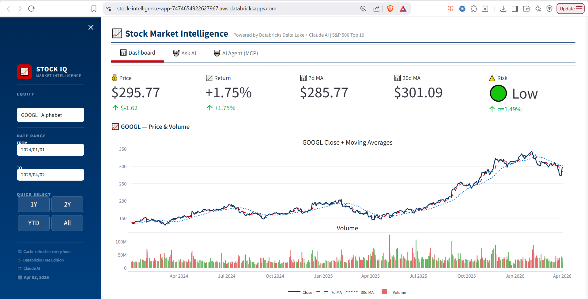
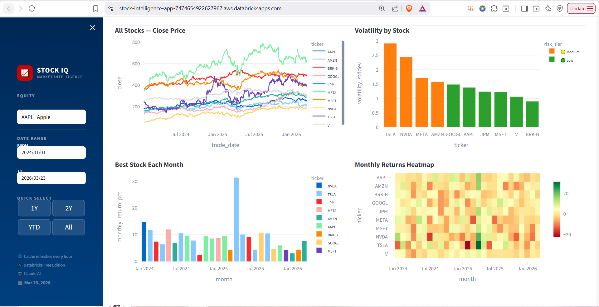
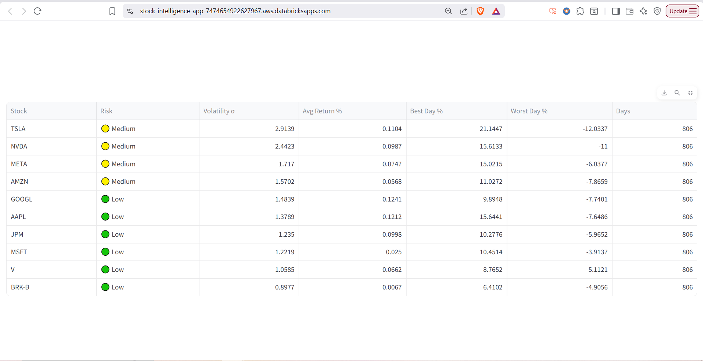
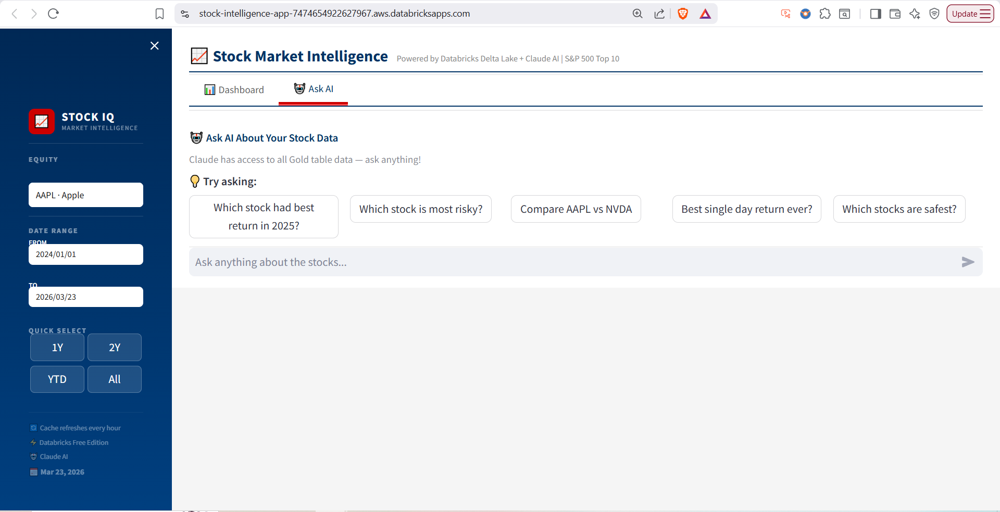

# 📈 Stock Market Intelligence App — Databricks Apps + Claude AI

## 🎯 Overview
An AI-powered stock market intelligence web app built entirely 
on Databricks Free Edition — combining live Delta table queries 
with natural language Q&A powered by Claude API.

# 🚀 Live Demo
🔗 [Open App](https://stock-intelligence-app-7474654922627967.aws.databricksapps.com)
> 💡 **To view the live app:** This runs on Databricks Free Edition which 
> auto-sleeps to manage resources. Drop me a message on 
> [LinkedIn](https://www.linkedin.com/in/sagar30601/) and I'll spin it up for you!

## 🏗️ Architecture

## 🛠️ Tech Stack
| Tool | Usage |
|---|---|
| Databricks Apps | App hosting — serverless, free |
| Streamlit | Web UI framework |
| yfinance | S&P 500 OHLCV data source |
| Unity Catalog | Gold layer Delta tables |
| Databricks SQL Warehouse | Live query engine |
| Claude API (claude-sonnet) | Natural language Q&A |
| PySpark | Data transformations |
| Plotly | Interactive charts |

## 📊 Features
- **Tab 1: Dashboard** — Live price trends, volatility, 
  moving averages, monthly rankings for top 10 S&P 500 stocks
- **Tab 2: Ask AI** — Natural language Q&A powered by 
  Claude API with Gold table data as context

## 📁 Gold Tables
| Table | Description |
|---|---|
| `daily_prices` | Daily OHLCV + moving averages per stock |
| `stock_volatility` | Stddev, risk tier per stock |
| `monthly_performance` | Monthly return rankings |

## 🏅 Key Highlights
- Zero infrastructure setup — runs 100% on Databricks Free Edition
- Live Delta table queries — data refreshes daily
- Claude API integration — natural language over structured data
- Finance domain — S&P 500 stocks aligned with MSCI background
